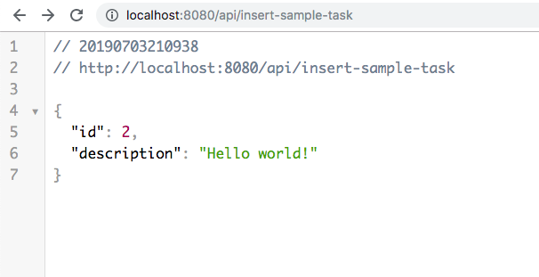
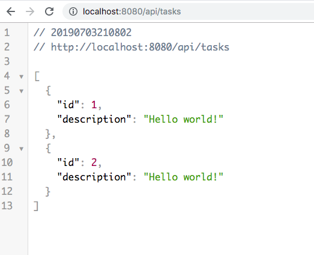

# Team Planner (aka Trello)

[](https://travis-ci.com/loyola-open-source-course/planner-backend)

This tool is useful for planning and organizing people work.


## How to start development?
1. Run MySQL database in a docker container (or install it separately as a standalone app):
    ```$bash
    docker run -d \
        --name=planner-db \
        -p 3306:3306 \
        -e MYSQL_DATABASE=planner \
        -e MYSQL_ROOT_PASSWORD=111 \
        mysql:5.7 \
            --character-set-server=utf8mb4 \
            --collation-server=utf8mb4_unicode_ci
        
    ```
2. Run app
 
    *Option 1.* Through IntelliJ Idea (through UI)
    * Open Project
    * Open Application class
    * Click on the green arrow at the left
    * Choose "Run Application"
    
    
    
    *Option 2.* By using gradle (through console)
    * Go to project directory where "build.gradle" file is
    * Run in console:  `./gradlew bootRun`
    
3. Go to hello world endpoint in browser

    
    
    
    
[TODO]